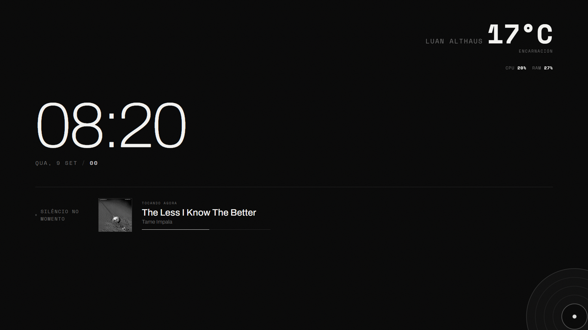

# Painel Spotify

Um painel estilo "dashboard" para desktop: relógio, data, o que está tocando no Spotify em tempo real, temperatura da sua cidade e uso de CPU/RAM do seu computador — tudo em uma tela preto e branco minimalista.



## O que ele mostra

- **Relógio e data** em tempo real
- **Now Playing do Spotify** — capa do álbum, música, artista e barra de progresso
- **Temperatura** da cidade que você configurar (via Open-Meteo, API gratuita, sem chave)
- **Uso de CPU e RAM** do computador onde o painel está rodando
- Um vinil animado no canto, que gira enquanto uma música está tocando

## Pré-requisitos

- [Node.js](https://nodejs.org/) versão 18 ou mais recente
- Uma conta Spotify (gratuita ou Premium, tanto faz — o painel só *lê* o que está tocando, não controla nada)

## Passo a passo de instalação

### 1. Clonar o repositório

```bash
git clone <url-do-seu-repositorio>
cd spotify-dashboard
```

### 2. Instalar as dependências

```bash
npm install
```

### 3. Criar um app no Spotify Developer Dashboard

O painel precisa de credenciais suas para poder consultar "o que está tocando agora" na sua conta.

1. Acesse https://developer.spotify.com/dashboard e faça login com sua conta Spotify
2. Clique em **Create app**
3. Preencha:
   - **App name**: qualquer nome (ex: "Meu Painel")
   - **App description**: qualquer descrição
   - **Redirect URI**: `http://127.0.0.1:4123/callback`
     - ⚠️ Precisa ser **exatamente** esse endereço (incluindo a porta `4123`). Se você mudar a porta no `.env` mais tarde, precisa atualizar aqui também.
4. Marque a caixa de concordância e clique em **Save**
5. Dentro do app criado, clique em **Settings** e copie o **Client ID** e o **Client Secret**

### 4. Configurar as variáveis de ambiente

```bash
cp .env.example .env
```

Abra o arquivo `.env` em um editor de texto e preencha com os dados que você copiou no passo anterior:

```
SPOTIFY_CLIENT_ID=seu_client_id_aqui
SPOTIFY_CLIENT_SECRET=seu_client_secret_aqui
SPOTIFY_REDIRECT_URI=http://127.0.0.1:4123/callback
PORT=4123
```

### 5. Personalizar o painel (nome, cidade e clima)

Abra o arquivo `public/script.js` e edite o bloco `CONFIG` bem no topo:

```javascript
const CONFIG = {
  displayName: 'Seu Nome',       // Nome mostrado ao lado da temperatura
  cityName: 'Sua Cidade',        // Nome da cidade mostrado no painel
  latitude: -25.4284,            // Latitude da sua cidade
  longitude: -49.2733,           // Longitude da sua cidade
};
```

Para achar a latitude/longitude da sua cidade, pesquise por "[nome da sua cidade] coordenadas" no Google, ou use https://www.latlong.net/.

### 6. Rodar o painel

```bash
npm start
```

Você verá no terminal:

```
Painel rodando em http://localhost:4123
Se ainda não conectou o Spotify, acesse http://localhost:4123/login uma vez.
```

### 7. Conectar sua conta Spotify (só na primeira vez)

Abra no navegador: **http://127.0.0.1:4123/login**

Você será redirecionado para autorizar o app na sua conta Spotify. Depois de autorizar, vai aparecer uma mensagem de sucesso — pode fechar essa aba. Isso cria um arquivo `tokens.json` na pasta do projeto, que guarda sua autorização (você não precisa fazer login de novo depois disso).

### 8. Abrir o painel

Acesse **http://127.0.0.1:4123** no navegador. Pronto — o painel está funcionando.

## Estrutura do projeto

```
spotify-dashboard/
├── server.js              # Backend: autenticação Spotify + API de now-playing e system stats
├── .env.example            # Modelo das variáveis de ambiente
├── package.json
└── public/
    ├── index.html           # Estrutura da página
    ├── style.css            # Visual (cores, fontes, animações)
    └── script.js            # Lógica: relógio, now-playing, clima, CPU/RAM, e o bloco CONFIG
```

## Personalização

- **Nome, cidade e coordenadas**: bloco `CONFIG` no topo de `public/script.js` (passo 5 acima)
- **Cores e fontes**: variáveis `:root` no topo de `public/style.css` (`--ink`, `--void`, `--mid`, etc.)
- **Frequência de atualização**: os `setInterval(...)` no final de cada seção do `script.js` controlam de quanto em quanto tempo cada widget atualiza (now-playing a cada 5s, clima a cada 10min, CPU/RAM a cada 5s)

## Rodando em tela cheia (opcional)

Se você quiser deixar isso ligado numa tela dedicada (tipo um monitor extra ou tablet), abra o navegador em modo kiosk/tela cheia apontando pra `http://127.0.0.1:4123`. No Chrome/Chromium, isso pode ser feito com a flag `--kiosk`. Esse modo de uso é opcional — o painel funciona normalmente como uma aba comum do navegador.

## Prevenção de bugs (Troubleshooting)

### "INVALID_CLIENT: Invalid redirect URI" ao acessar /login

A URL de redirecionamento no Spotify Dashboard (passo 3) precisa ser **idêntica, caractere por caractere**, à `SPOTIFY_REDIRECT_URI` do seu `.env`. Confira se não tem `/` sobrando no final, se a porta bate, e se é `http` (não `https`).

### O painel mostra "Silêncio no momento" mesmo com música tocando

- Confirme que o Spotify está **realmente tocando** em algum dispositivo (celular, PC, alto-falante) — a API só retorna dados se houver reprodução ativa
- Sessões privadas do Spotify (modo anônimo) não aparecem na API
- Espere alguns segundos — o painel atualiza a cada 5 segundos

### Erro "NOT_AUTHENTICATED" no terminal

O arquivo `tokens.json` não existe ou está inválido. Acesse `/login` de novo (passo 7) para gerar um novo.

### CPU e RAM sempre mostram "--%"

O backend (`server.js`) precisa estar rodando a versão mais recente do código. Diferente do frontend (que só precisa de F5 na página), mudanças no `server.js` exigem **reiniciar o processo Node** (`Ctrl+C` e `npm start` de novo).

### A temperatura sempre mostra "--°C"

- Confirme que `latitude` e `longitude` no `CONFIG` (passo 5) foram preenchidas corretamente, com o sinal de menos quando aplicável (ex: `-25.4284`, não `25.4284`)
- Confirme que o computador tem acesso à internet — a API do clima (Open-Meteo) precisa de conexão externa

### A temperatura mostrada é um pouco diferente de outros apps de clima

Isso é normal — cada serviço meteorológico usa modelos de previsão diferentes, então uma diferença de 1-2°C entre fontes é esperada. Não indica erro.

### Erro "EADDRINUSE" ou "porta já em uso" ao rodar npm start

Outra coisa já está usando a porta 4123. Ou feche o que está usando essa porta, ou mude o valor de `PORT` no `.env` (lembrando de atualizar também a `SPOTIFY_REDIRECT_URI` e o Redirect URI no Spotify Dashboard para bater com a nova porta).

### npm install falha ou dá erro de versão

Confirme que está usando Node.js 18 ou mais recente: `node --version`. Versões mais antigas podem não suportar alguns recursos usados no projeto.

## Licença

Sinta-se livre para usar, modificar e distribuir este projeto.
